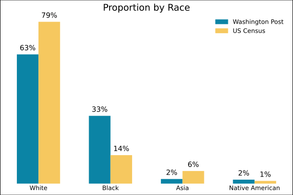
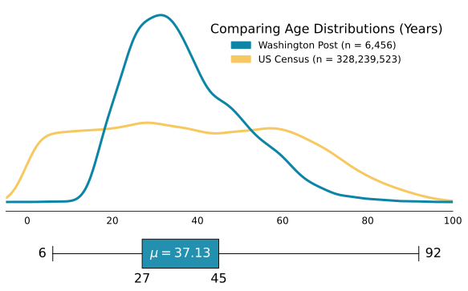

# police_shootings
On August 9th, 2014 Michael Brown was shot by a police officer in Ferguson, Missouri. The killing initiated protests across the country. As journalist documented the movement a Washington Post investigation found that the [FBI undercounted fatal police shootings by more than half](https://www.washingtonpost.com/news/post-nation/wp/2014/09/08/how-many-police-shootings-a-year-no-one-knows/). Inspired by the protests and the lack of accurate information, in 2015, the [Washington Post began tracking](https://www.washingtonpost.com/graphics/investigations/police-shootings-database/) every fatal shooting by an on-duty police officer. The Washington Post collects information on several demographic indicators, the circumstances of the shooting, and whether the person was experiencing a mental-health crisis by sourcing local news reports, law enforcement websites, law enforcement social media accounts, and by monitoring independent databases such as Killed by Police. This repository contains some of the code I wrote for a research project that used the Washington Post's Fatal Forces database.

## Data

#### ./data/age.csv
Year: Vintage 2019  
Population Estimate API: Demographic Characteristics Estimates by Single Year of Age and Sex  
General Info: https://www.census.gov/data/developers/data-sets/popest-popproj/popest.html

#### ./data/race.csv
Year: Vintage 2019  
Population Estimate API: Demographic Characteristics Estimates by Single Year of Age and Sex  
General Info: https://www.census.gov/data/developers/data-sets/popest-popproj/popest.html  
RACE Catagorical Info: https://api.census.gov/data/2019/pep/charage/variables/RACE.json  

- 0: All races
- 1: White alone
- 2: Black alone
- 3: American Indian and Alaska Native alone
- 4: Asian alone
- 5: Native Hawaiian and Other Pacific Islander alone
- 6: Two or more races
- 7: White alone or in combination
- 8: Black alone or in combination
- 9: American Indian and Alaska Native alone or in combination
- 10: Asian alone or in combination
- 11: Native Hawaiian and Other Pacific Islander alone or in combination

#### ./data/shooting.csv
Source: https://github.com/washingtonpost/data-police-shootings  

## Visualizations

 

 
 

