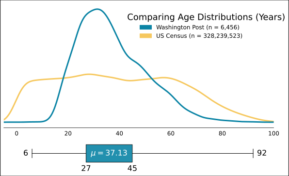

# police_shootings
Some of the code used for school research project on police shootings.

## Files

#### ./data/age.csv
Year: Vintage 2019  
Population Estimate API: Demographic Characteristics Estimates by Single Year of Age and Sex  
General Info: https://www.census.gov/data/developers/data-sets/popest-popproj/popest.html

#### ./data/race.csv
Year: Vintage 2019  
Population Estimate API: Demographic Characteristics Estimates by Single Year of Age and Sex  
General Info: https://www.census.gov/data/developers/data-sets/popest-popproj/popest.html  
RACE Catagorical Info: https://api.census.gov/data/2019/pep/charage/variables/RACE.json  

- 0: All races
- 1: White alone
- 2: Black alone
- 3: American Indian and Alaska Native alone
- 4: Asian alone
- 5: Native Hawaiian and Other Pacific Islander alone
- 6: Two or more races
- 7: White alone or in combination
- 8: Black alone or in combination
- 9: American Indian and Alaska Native alone or in combination
- 10: Asian alone or in combination
- 11: Native Hawaiian and Other Pacific Islander alone or in combination

#### ./data/shooting.csv
Source: https://github.com/washingtonpost/data-police-shootings  

## Visualizations

 

 
 

